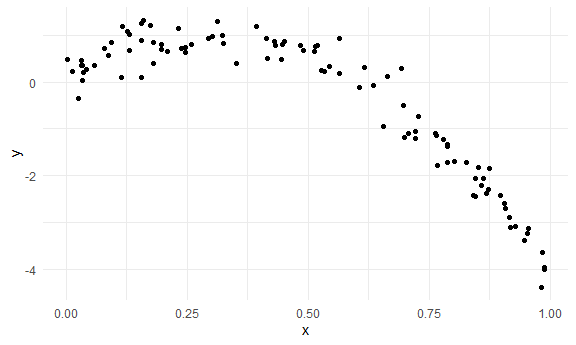
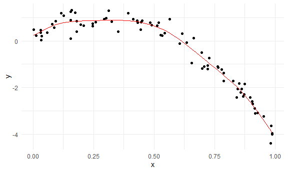
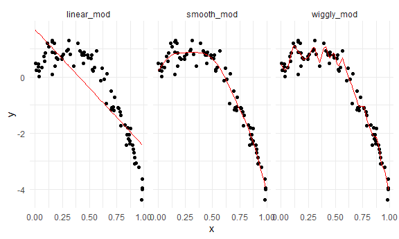

Linear Models
================

``` r
library(tidyverse)
```

    ## -- Attaching packages ---- tidyverse 1.3.0 --

    ## v ggplot2 3.3.2     v purrr   0.3.4
    ## v tibble  3.0.3     v dplyr   1.0.2
    ## v tidyr   1.1.2     v stringr 1.4.0
    ## v readr   1.3.1     v forcats 0.5.0

    ## Warning: package 'ggplot2' was built under R version 4.0.3

    ## -- Conflicts ------- tidyverse_conflicts() --
    ## x dplyr::filter() masks stats::filter()
    ## x dplyr::lag()    masks stats::lag()

``` r
library(mgcv)
```

    ## Loading required package: nlme

    ## 
    ## Attaching package: 'nlme'

    ## The following object is masked from 'package:dplyr':
    ## 
    ##     collapse

    ## This is mgcv 1.8-33. For overview type 'help("mgcv-package")'.

``` r
library(modelr)


knitr::opts_chunk$set(
  fig.width = 6, 
  fig.asp = .6,
  out.width = "90%"
)

theme_set(theme_minimal() + theme(legend.position = "bottom"))

options(
  ggplot2.continuous.colour = "viridis", 
  ggplot2.continuous.fill = "viridis"
)

scale_colour_discrete = scale_colour_viridis_d
scale_fill_discrete = scale_fill_viridis_d
```

## Simulate data

``` r
nonlin_df = 
  tibble(
    id = 1:100,
    x = runif(100, 0, 1),
    y = 1 - 10 * (x - .3)^2 + rnorm(100, 0, .3)
  )
```

Look at data (nonlinear)

``` r
nonlin_df %>% 
  ggplot(aes(x = x, y = y)) + 
  geom_point()
```



## Cross validaton – by hand

Get training and testing datasets

Should be 100 rows in our nonlin\_df

``` r
train_df = sample_n(nonlin_df, size = 80)

# get the 20 rows that do not appear in training df

test_df = anti_join(nonlin_df, train_df, by = "id")
```

models of varying complexity

Fit three models:

``` r
linear_mod = lm(y ~ x, data = train_df)
smooth_mod = gam(y ~ s(x), data = train_df)
#make one where you're chasing every single data point
wiggly_mod = gam(y ~ s(x, k = 30), sp = 10e-6, data = train_df)
```

Can I see what I just did…

``` r
train_df %>% 
  add_predictions(smooth_mod) %>% 
  ggplot(aes(x = x, y = y)) + 
  geom_point() + 
  geom_line(aes(y = pred), color = "red")
```



Can gather predictions

``` r
train_df %>% 
  gather_predictions(linear_mod, smooth_mod, wiggly_mod) %>% 
  ggplot(aes(x = x, y = y)) + 
  geom_point() + 
  geom_line(aes(y = pred), color = "red") + 
  facet_grid(. ~ model)
```



Look at prediction accuracy

RMSE

``` r
rmse(linear_mod, test_df)
```

    ## [1] 0.8943711

``` r
rmse(smooth_mod, test_df)
```

    ## [1] 0.3751343

``` r
rmse(wiggly_mod, test_df)
```

    ## [1] 0.4661487

Of the three models - smooth model seems best
