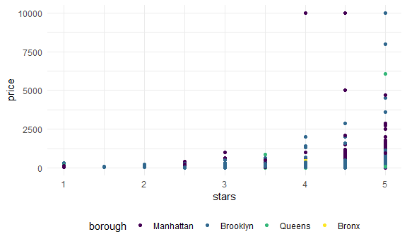
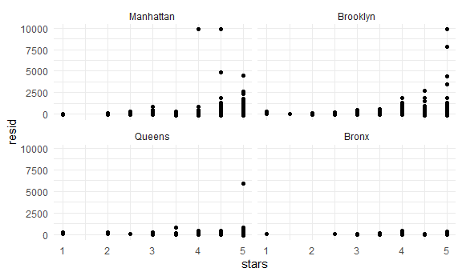

Linear Models
================

``` r
library(tidyverse)
```

    ## -- Attaching packages --------

    ## v ggplot2 3.3.2     v purrr   0.3.4
    ## v tibble  3.0.3     v dplyr   1.0.2
    ## v tidyr   1.1.2     v stringr 1.4.0
    ## v readr   1.3.1     v forcats 0.5.0

    ## Warning: package 'ggplot2' was built under R version 4.0.3

    ## -- Conflicts -----------------
    ## x dplyr::filter() masks stats::filter()
    ## x dplyr::lag()    masks stats::lag()

``` r
library(p8105.datasets)

knitr::opts_chunk$set(
  fig.width = 6, 
  fig.asp = .6,
  out.width = "90%"
)

theme_set(theme_minimal() + theme(legend.position = "bottom"))

options(
  ggplot2.continuous.colour = "viridis", 
  ggplot2.continuous.fill = "viridis"
)

scale_colour_discrete = scale_colour_viridis_d
scale_fill_discrete = scale_fill_viridis_d
```

\#Problem 1

``` r
data("nyc_airbnb")

nyc_airbnb = 
  nyc_airbnb %>% 
  mutate(stars = review_scores_location / 2) %>% 
  rename(
    borough = neighbourhood_group,
    neighborhood = neighbourhood) %>% 
  filter(borough != "Staten Island") %>%
  #filer out Staten Isalnd
  select(price, stars, borough, neighborhood, room_type)
```

## Fit a model

Star rating for borough?

``` r
nyc_airbnb %>% 
  ggplot(aes(x = stars, y = price, color = borough)) +
  geom_point()
```

    ## Warning: Removed 9962 rows containing missing values (geom_point).


``` r
fit = lm(price ~ stars + borough, data = nyc_airbnb)
```

lets look at result

Let’s look at results better

``` r
broom::glance(fit)
```

    ## # A tibble: 1 x 12
    ##   r.squared adj.r.squared sigma statistic   p.value    df  logLik    AIC    BIC
    ##       <dbl>         <dbl> <dbl>     <dbl>     <dbl> <dbl>   <dbl>  <dbl>  <dbl>
    ## 1    0.0342        0.0341  182.      271. 6.73e-229     4 -2.02e5 4.04e5 4.04e5
    ## # ... with 3 more variables: deviance <dbl>, df.residual <int>, nobs <int>

``` r
broom::tidy(fit) %>% 
  select(-std.error, -statistic) %>% 
  mutate(
    term = str_replace(term, "borough", "Borough: ")
    ) %>% 
  knitr::kable(digits = 3)
```

| term               | estimate | p.value |
| :----------------- | -------: | ------: |
| (Intercept)        | \-70.414 |   0.000 |
| stars              |   31.990 |   0.000 |
| Borough: Brooklyn  |   40.500 |   0.000 |
| Borough: Manhattan |   90.254 |   0.000 |
| Borough: Queens    |   13.206 |   0.145 |

## Be in control of factors

Character var often just get converted to factor variable (see how plot
puts them in order; same as in regression fit model)

what if want ref category the most common one? room type?

``` r
nyc_airbnb = 
  nyc_airbnb %>% 
  mutate(
    borough = fct_infreq(borough), 
    room_type = fct_infreq(room_type)
  )

nyc_airbnb %>% 
  ggplot(aes(x = stars, y = price, color = borough)
         ) +
  geom_point()
```

    ## Warning: Removed 9962 rows containing missing values (geom_point).



``` r
fit = lm(price ~ stars + borough, data = nyc_airbnb)

broom::tidy(fit)
```

    ## # A tibble: 5 x 5
    ##   term            estimate std.error statistic   p.value
    ##   <chr>              <dbl>     <dbl>     <dbl>     <dbl>
    ## 1 (Intercept)         19.8     12.2       1.63 1.04e-  1
    ## 2 stars               32.0      2.53     12.7  1.27e- 36
    ## 3 boroughBrooklyn    -49.8      2.23    -22.3  6.32e-109
    ## 4 boroughQueens      -77.0      3.73    -20.7  2.58e- 94
    ## 5 boroughBronx       -90.3      8.57    -10.5  6.64e- 26

## Diagnostics

``` r
nyc_airbnb %>% 
  modelr::add_residuals(fit) %>% 
  ggplot(aes(x = stars, y = resid)) + 
  geom_point() + 
  facet_wrap(. ~ borough)
```

    ## Warning: Removed 9962 rows containing missing values (geom_point).



Outliers??

## Hypothesis Tests

T test by default

``` r
fit %>% 
  broom::tidy()
```

    ## # A tibble: 5 x 5
    ##   term            estimate std.error statistic   p.value
    ##   <chr>              <dbl>     <dbl>     <dbl>     <dbl>
    ## 1 (Intercept)         19.8     12.2       1.63 1.04e-  1
    ## 2 stars               32.0      2.53     12.7  1.27e- 36
    ## 3 boroughBrooklyn    -49.8      2.23    -22.3  6.32e-109
    ## 4 boroughQueens      -77.0      3.73    -20.7  2.58e- 94
    ## 5 boroughBronx       -90.3      8.57    -10.5  6.64e- 26

``` r
# hypothesis test on estimates 
```

ANOVA? Significance of borough?

``` r
fit_null = lm(price ~ stars, data = nyc_airbnb)
# null H, if borough has no affect 

fit_alt = lm(price ~ stars + borough, data = nyc_airbnb)

anova(fit_null, fit_alt) %>% 
  broom::tidy()
```

    ## # A tibble: 2 x 6
    ##   res.df         rss    df     sumsq statistic    p.value
    ##    <dbl>       <dbl> <dbl>     <dbl>     <dbl>      <dbl>
    ## 1  30528 1030861841.    NA       NA        NA  NA        
    ## 2  30525 1005601724.     3 25260117.      256.  7.84e-164

## Nest data, fit models

Assoc btw stars and price? Does this differ by borough?

``` r
fit = lm(price ~ stars * borough + room_type * borough, data = nyc_airbnb)

broom::tidy(fit)
```

    ## # A tibble: 16 x 5
    ##    term                                  estimate std.error statistic  p.value
    ##    <chr>                                    <dbl>     <dbl>     <dbl>    <dbl>
    ##  1 (Intercept)                              95.7      19.2     4.99   6.13e- 7
    ##  2 stars                                    27.1       3.96    6.84   8.20e-12
    ##  3 boroughBrooklyn                         -26.1      25.1    -1.04   2.99e- 1
    ##  4 boroughQueens                            -4.12     40.7    -0.101  9.19e- 1
    ##  5 boroughBronx                             -5.63     77.8    -0.0723 9.42e- 1
    ##  6 room_typePrivate room                  -124.        3.00  -41.5    0.      
    ##  7 room_typeShared room                   -154.        8.69  -17.7    1.42e-69
    ##  8 stars:boroughBrooklyn                    -6.14      5.24   -1.17   2.41e- 1
    ##  9 stars:boroughQueens                     -17.5       8.54   -2.04   4.09e- 2
    ## 10 stars:boroughBronx                      -22.7      17.1    -1.33   1.85e- 1
    ## 11 boroughBrooklyn:room_typePrivate room    32.0       4.33    7.39   1.55e-13
    ## 12 boroughQueens:room_typePrivate room      54.9       7.46    7.37   1.81e-13
    ## 13 boroughBronx:room_typePrivate room       71.3      18.0     3.96   7.54e- 5
    ## 14 boroughBrooklyn:room_typeShared room     47.8      13.9     3.44   5.83e- 4
    ## 15 boroughQueens:room_typeShared room       58.7      17.9     3.28   1.05e- 3
    ## 16 boroughBronx:room_typeShared room        83.1      42.5     1.96   5.03e- 2

Something more exploratory

``` r
nyc_airbnb %>% 
  nest(data = -borough) %>% 
  mutate(
    models = map(.x = data, ~lm(price ~ stars, data = .x)),
    results = map(models, broom::tidy)
  ) %>% 
  select(-data, -models) %>% 
  unnest(results)
```

    ## # A tibble: 8 x 6
    ##   borough   term        estimate std.error statistic  p.value
    ##   <fct>     <chr>          <dbl>     <dbl>     <dbl>    <dbl>
    ## 1 Bronx     (Intercept)    49.9      18.3      2.72  6.71e- 3
    ## 2 Bronx     stars           4.91      4.10     1.20  2.31e- 1
    ## 3 Queens    (Intercept)    18.1      26.3      0.688 4.92e- 1
    ## 4 Queens    stars          15.8       5.63     2.81  5.06e- 3
    ## 5 Brooklyn  (Intercept)   -11.3      14.5     -0.784 4.33e- 1
    ## 6 Brooklyn  stars          28.0       3.10     9.02  2.13e-19
    ## 7 Manhattan (Intercept)   -34.3      22.9     -1.50  1.35e- 1
    ## 8 Manhattan stars          43.3       4.78     9.07  1.39e-19
